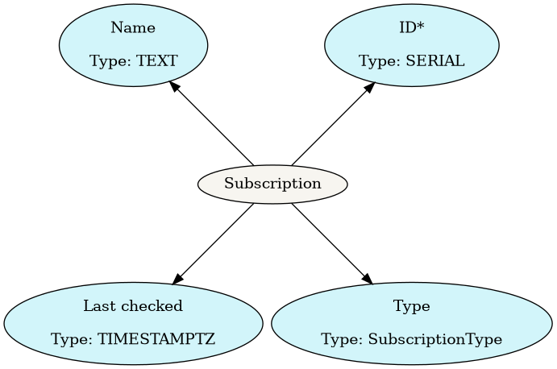
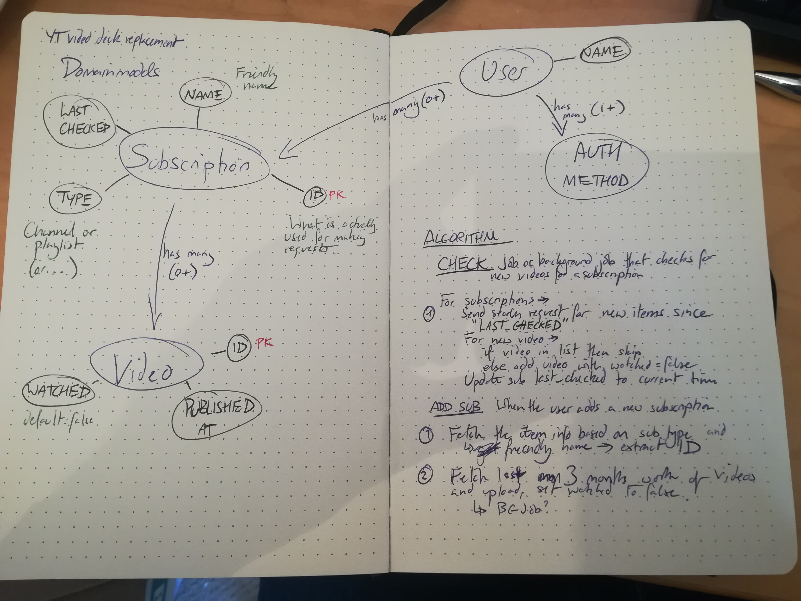

# Design doc

## Objectives

The app should support the following functionalities (in order of imporatance):

1. Allow the user to check their subscriptions for the latest videos
2. Support channels and playlists
3. Search for channels or playlists
4. Do not require _youtube_ authentication for the user
3. *(optional)* Support authentication using multiple methods (oauth, username/pw)

## Components

### Domain models (mapping to database tables)

#### Subscription

*Responsibilities*

* links the subscription ID to a series of videos
* tracks the last time the subscription was checked for new items
* stores whether the subscription is a channel or playlist

#### Video

#### User

#### Authentication

### Helper classes

#### Youtube client

This object decouples the domain models from the Youtube API. It supports the following methods:

* Search Youtube for either the channel or playlist with the given name
* Fetch new items (videos) since a specified time

## Questions

* [ ] can the API check multiple subscriptions (channels or playslists) in a single request?
* [ ] does the search method of the Youtube API return what the matched result is?
* [ ] django enumeration support (`Subscription.type` field)

## Initial sketch

The initial sketch drawn in a notebook is:

